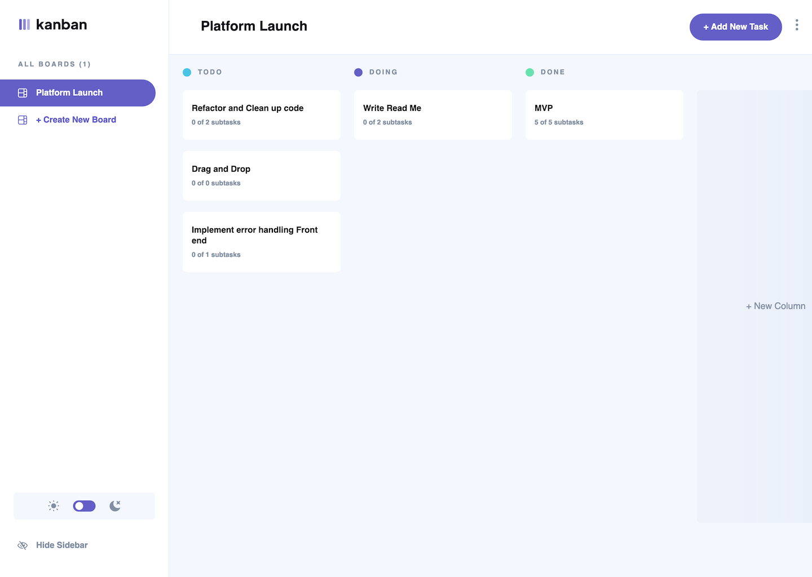

# Frontend Mentor - Kanban task management web app solution

This is a solution to the [Kanban task management web app challenge on Frontend Mentor](https://www.frontendmentor.io/challenges/kanban-task-management-web-app-wgQLt-HlbB). Frontend Mentor challenges help you improve your coding skills by building realistic projects.

## Table of contents

- [Overview](#overview)
  - [The challenge](#the-challenge)
  - [Screenshot](#screenshot)
  - [Links](#links)
- [My process](#my-process)
  - [Built with](#built-with)
  - [What I learned](#what-i-learned)
  - [Continued development](#continued-development)
  - [Useful resources](#useful-resources)
- [Author](#author)
- [Acknowledgments](#acknowledgments)

## Overview

### The challenge

Users should be able to:

- View the optimal layout for the app depending on their device's screen size
- See hover states for all interactive elements on the page
- Create, read, update, and delete boards and tasks
- Receive form validations when trying to create/edit boards and tasks
- Mark subtasks as complete and move tasks between columns
- Hide/show the board sidebar
- Toggle the theme between light/dark modes
- **Bonus**: Allow users to drag and drop tasks to change their status and re-order them in a column
- **Bonus**: Keep track of any changes, even after refreshing the browser (`localStorage` could be used for this if you're not building out a full-stack app)
- **Bonus**: Build this project as a full-stack application

### Screenshot

### Links

- [Solution](https://www.frontendmentor.io/solutions/fullstack-kanban-workflow-management-app-O8yM3aeElN)
- [Live Site](https://kanban.cyclic.app/)
- [Github](https://github.com/dorian-edwards/kanbanReact/tree/main)

## My process

### Built with

- Semantic HTML5 markup
- Flexbox
- Mobile-first workflow
- [TypeScript](https://www.typescriptlang.org/)
- [Tailwindcss](https://tailwindcss.com/)
- [React](https://reactjs.org/)
- [React Router](https://reactrouter.com/en/main)
- [MongoDB Atlas](https://www.mongodb.com/atlas/database)
- [Mongoose](https://mongoosejs.com/docs/)
- [PassportJS](https://www.passportjs.org/)
- [Cyclic](https://app.cyclic.sh/)

### What I learned

I don't even know where to start. I learned so much. For starters I learned how to write CRUD endpoints for fairly complex data models. Not only was this a simple create, read edit delete, but it due to the nesting of components and using two-way pointers in my data models, removing one data structure meant I had to everthing associated with so I had to write functions to cleanup the database. I utilized JavaScript maps to write functions that are O(n) instead of Array.find or Array.includes which would've been O(n2).

I learned how to implement Overlays in react for the dark background effect when viewing or editing boards or tasks. This project also required use of React Router and user authentication and authorization which meant implement Passport on the back-end and getting that play nicely with React on the front-end.

As the front end was built with TypeScript that itself was a huge learning curve and I abandoned the idea early in the project until I got some inspiration from a codebase sent to me by a recruiter. After that I converted everything I had in JavaScript so far to TypeScript and while I can't say it was a painless process, in the end I got it working. This meant writing interfects correctly, and in such a way that the components could be re-used and expanded, a tricky skill I'm still getting the hang of.

And last but not least I also learned how to deploy my app on a new hosting service, Cyclic. Unfortunately it's not listed as a trusted host with FrontEnd Mentor so it will be hosted on heroku as well until they change their pricing model at the end of November 2022.

### Continued development

So much more work needs to be done on error handling, both front-end and back-end, and ultimately I would like to implement drag and drop functionality per the bonus requirements.

### Useful resources

- [Creating React Overlays](https://towardsdev.com/creating-overlays-in-reactjs-30b1dfa010a6) - this is a great article in implementing Overlays in React
- [Stack Overflow](https://stackoverflow.com/) - because of course
- [React & Passport](https://www.youtube.com/watch?v=IUw_TgRhTBE) - this video helped me get Passport and React up and running

> Other resources I used are listed in the [built with](#built-with) section above.

## Author

- Website - [Dorian Edwards](https://dorianedwards.dev)
- Frontend Mentor - [@yourusername](https://www.frontendmentor.io/profile/yourusername)
- Twitter - [@dorian_dev](https://twitter.com/dorian_dev)
- LinkedIn - [dorian-edwards](https://www.linkedin.com/in/dorian-edwards/)
- Github - [dorian-edwards](https://github.com/dorian-edwards)

## Acknowledgments

Shout out to [Leon Noel and 100Devs](https://leonnoel.com/100devs/). Everyone in that discord channel is awesome, helpful, and just a pleasure to work with.
